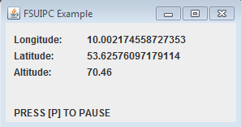

# Homecockpit-FSUIPC

### [FSUIPC Library](./fsuipc)

Java library for FSUIPC which is based on the java implementation of the [FSUIPC SDK](http://www.schiratti.com/dowson.html).

### [FSUIPC HTTP-Server](./fsuipc2http)

The FSUIPC HTTP-Server can be used to connect to fsuipc over the network.

### [FSUIPC Library Example](./example)

Example use of the FSUIPC Library

## Requires

* FSUIPC ([http://www.schiratti.com/dowson.html](http://www.schiratti.com/dowson.html))

## Licensing

The project is released under version 2.0 of the Apache License. See LICENSE.txt for details.

